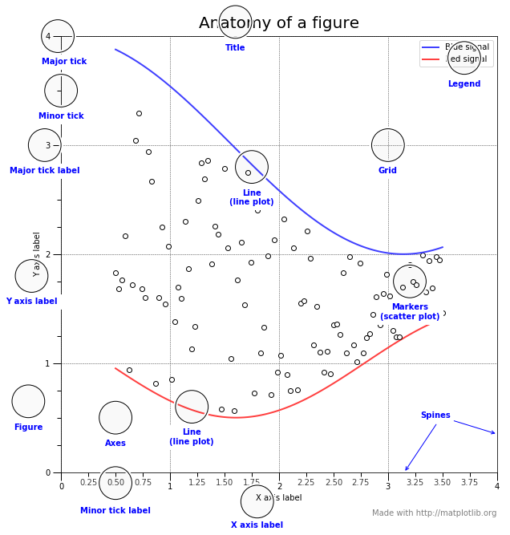

```{r setup, include=FALSE}
knitr::opts_chunk$set(echo = TRUE, comment = NA, message = FALSE, warning = FALSE)
```


```{r fig.cap="Source: https://ggplot2.tidyverse.org/", out.extra="class=external", fig.align='center', fig.height= 3, fig.width=8,  echo=FALSE}
knitr::include_graphics("ggplot2.png")
```


## Prerequisites 
* To follow along you will need the following 
  * R - https://cran.r-project.org/
  * RStudio - https://rstudio.com/products/rstudio/download/
  
If you want to work in cloud, you can use **RStudio Cloud Service ** https://rstudio.cloud/

* You will need the `ggplot2` installed in your R environment. 
* To install the `ggplot2` package just run this command in your R Console 
```r
install.packages("ggplot2")
```

## What is ggplot2? 
**ggplot2** is a data visualization package for the statistical programming language R. Created by **Hadley Wickham** in 2005, ggplot2 is an implementation of Leland Wilkinson's Grammar of Graphics—a general scheme for data visualization which breaks up graphs into semantic components such as scales and layers.


## Types of Visualization 
In statistics, we generally have two kinds of visualization:

* **Exploratory data visualization:** Exploring the data visually to find patterns among the data entities.

* **Explanatory data visualization:** Showcasing the identified patterns using simple graphs.


## Why Visualization? 
> "A picture is worth a thousand words"

Data visualizations make big and small data easier for the human brain to understand, and visualization also makes it easier to detect patterns, trends, and outliers in groups of data.

Good data visualizations should place meaning into complicated datasets so that their message is clear and concise.


##  Grammar of Graphics
|Component | Description|
|----------|:-----------|
|Data| The dataset being plotted|
|Aesthetics|The scales onto which we plot our data|
|Geometry | The visual elements used for our data|
|Facet | Groups by which we divide the data|

## Anatomy of a Graph 

```{r fig.cap="Source: https://matplotlib.org/index.html", out.extra="class=external", fig.align='center', fig.height= 3, fig.width=8,  echo=FALSE}

```


## The Data 
R has many built-in datasets. To check the R datasets you can run `data()` command, and it will give you a lot of datasets. 

```{r, datasets}
data()
```
In this article, I'll use the [Titanic](https://www.kaggle.com/c/titanic) dataset from [Kaggle](https://www.kaggle.com/c/titanic).

## Load `ggplot2`
```{r, ggplot2}
library(ggplot2)
```

## Reading Data 
```{r, load-data}
dataset <- read.csv("titanic.csv")
```

## Titanic Dataset 
```{r, head, layout="l-body-outset", echo=FALSE}
library(knitr)
# Examine first few rows 
kable(head(dataset), caption = "First few Rows of Titanic Dataset", )
```

## Data Dictionary 
Variable Name| Description | Variable Type
----------------------|-----------------------|--------------------------
Survived | Survival | Categorical(aka; Binary), Yes=1, No = 0
Pclass | Ticket class | Categorical, 1 = First Class, 2 = Second Class, 3 = Third Class 
Sex | Gender | Categorical(aka; Binary), Male and Female 
SibSp | # of siblings / spouses abroad the Titanic | Categirical, 1 = Yes, 0 = No
Parch | # of parents / children abroad the Titanic | Categirical, 1 = Yes, 0 = No
Ticket | Ticket Number | Categirical
Fare | Passenger fare | Numeric
Cabin | Cabin Number | Categorical 
Embarked | Port of Embarkation | C = Cherbourg, Q = Queenstown, S = Sothanpton


